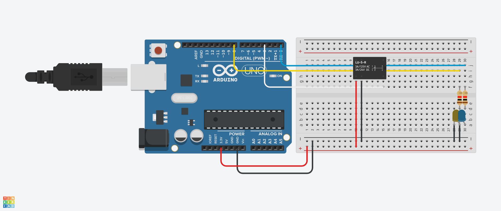
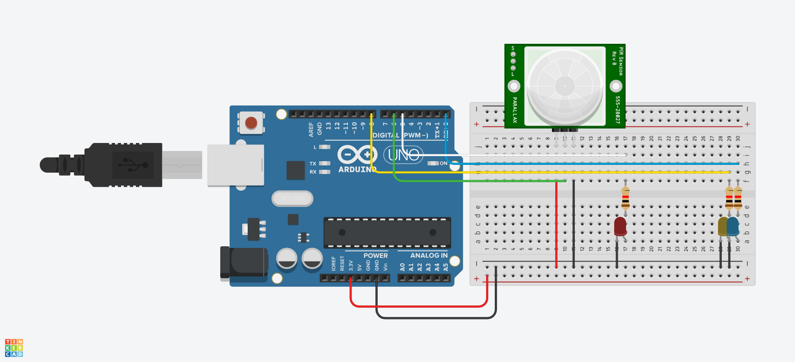
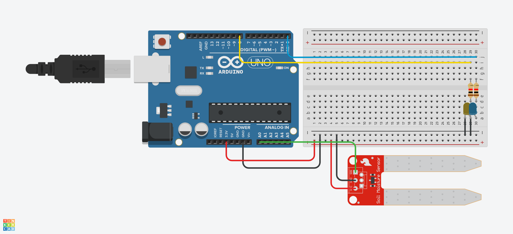
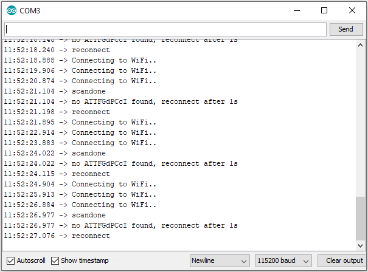

## About The Project

These folders consist of the breadboard schematics and code to build and run the working IoT devices for its parent project: [IoT Smart Home.](https://github.com/brenwick64/iot_client)


### Built With

[![Arduino][Arduino]][Arduino-url] [![Websockets][Websockets]][Websockets-url] [![C++][C++]][C++-url]


### Hardware Shopping List


<ins>All Devices</ins>

| Amount       | Component                       | 
| :---         |    :----:                       |  
| 1            | USB to Micro USB cable          | 
| 1            | ESP8266 Development Board       | 
| 1            | Small (400 pin) Breadboard      | 
| 1            | Blue LED                        | 
| 1            | Yellow LED                      | 
| 3            | 1k ohm Resistor                 | 
| Many         | 22 Gauge Jumper Wire            | 

<ins>Relay</ins>

| Amount       | Component                       | 
| :---         |    :----:                       |   
| 1            | 1 Channel 5V Relay Module       | 


<ins>Motion Sensor</ins>

| Amount       | Component                       | 
| :---         |    :----:                       |   
| 1            | Red LED                         | 
| 1            | PIR Motion Sensor Module        | 

<ins>Soil Sensor</ins>

| Amount       | Component                       | 
| :---         |    :----:                       |   
| 1            | Resistive Soil Moisture Meter   | 


### Wiring Diagrams

_Below are the wiring diagrams for each device:_

<ins>Relay</ins>



<ins>Motion Sensor</ins>



<ins>Soil Sensor</ins>




### Firmware Installation

_Below are the steps to install and run the firmware on each device_

1. Install the [Arduino IDE](https://www.arduino.cc/en/software)
2. Assemble the required components and build the desired device based on the above wiring diagrams.
3. Download the appropriate IoT firmware matching the device built.
4. Enter your WiFi credentials before flashing to board
   ```cpp
   const char *ssid = "<WIFI_SSID>";
   const char *password = "<WIFI_PASSWORD>";
   ```
4. Upload firmware to ESP8266/Arduino Board 
 
### Troubleshooting

_Below are tips to use the serial monitor to debug the state of the device_

* Open up the Serial Monitor and set the transmission speed to 115200 baud
* Information displayed in this panel will reflect the state of the device and often provides insights to unexpected behaviors.

_Ex: Diagnosing incorrect WiFi Credentials_



<!-- MARKDOWN LINKS & IMAGES -->

<!-- Shields -->
[Arduino]: https://img.shields.io/badge/Arduino-20232A?style=for-the-badge&logo=arduino&logoColor=008184
[Arduino-url]: https://www.arduino.cc/

[Websockets]: https://img.shields.io/badge/Websockets-20232A?style=for-the-badge&logo=Socket.io&logoColor=white
[Websockets-url]:https://socket.io/

[C++]: https://img.shields.io/badge/C++-20232A?style=for-the-badge&logo=cplusplus&logoColor=649ad2
[C++-url]:https://isocpp.org/

